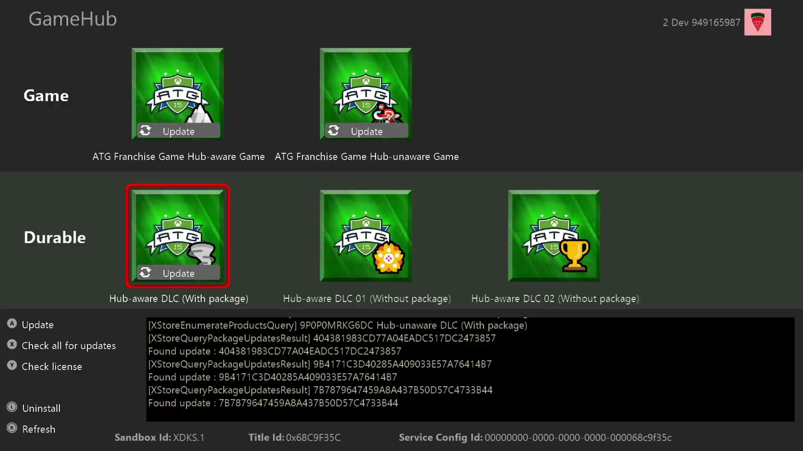

#   Franchise Game Hub sample

This sample is compatible with the Microsoft GDK (October 2023)

# Description

A Franchise Hub is a way for a publisher to offer a curated organization of related titles in a way that keeps the user in a shared experience between games.
It serves as a central point to acquire, install, and launch related titles, as well as host a persistent local storage space that related titles can use.

This sample demonstrates how to implement the many operations expected for the user experience.
It comprises three projects:
- A game hub product (GameHub) that shows what titles are related and what can be done for each
- A hub-aware product (RequiredGame) that will require the game hub to launch and is able to read shared data written by the hub
- A hub-unaware product (RelatedGame) that does not require the game hub to launch; this represents a older title that still otherwises wishes to be associated with the game hub, but cannot utilize any Game Hub specific fields and API due to it having shipped on an older GDK

# Building the sample

If using an Xbox Series X|S devkit, set the active solution platform to `Gaming.Xbox.Scarlett.x64`.

If using an Xbox One devkit, set the active solution platform to `Gaming.Xbox.XboxOne.x64`.

If using a Windows PC, set the active solution platform to `Gaming.Desktop.x64`.
Note while the code should compile, Franchise Game Hub is primarily a console feature and some functionality may not work.

*For more information, see* __Running samples__, *in the GDK documentation.*

# Running the sample

This sample is configured to work in the XDKS.1 sandbox.
A test account is required for purchase and installation operations.
Any @xboxtest.com test account should work in XDKS.1 sandbox.

The top row shows the games that are related to the game hub, in this case there are two.
When each title is selected, each of its associated add-ons are listed below.
Each can be purchased, and in the case of a game or DLC with package, installed.

Once installed, each game can be launched.
The hub-aware game will be able to show the contents of a file written to shared PLS as well as transition back to the hub.

The hub-unaware game can only be launched--it is otherwise unaware that it was from the hub.

All of this can be done with the Game Hub running through Visual Studio debugging, but scripts are available to make each of the projects into packages:
- `makepcpkg.cmd`
- `makescarlett.cmd`
- `makexboxone.cmd`

After packages are made, install each with `xbapp install`. 
This allows interaction with locally built packages without needing to obtain and install from the Store.

This is especially important when trying to test updates, as a local build (deployed or packaged) cannot be updated to a Store build.
For this purpose, a separate set of scripts is available in the UpdateTesting directory:
- `buildpackages.cmd`: builds v100 and v200 versions of packages for both associated games and a DLC for each
- `installandstageupdates.cmd`: `xbapp install` v100 of the packages and `xbapp update /a` v200 for each, simulating availability of an update.

The result of this should be that the game should reflect that updates are available for each, and enable the update flow.

# Implementation notes

`XPackageEnumeratePackages` can seem to return the same results for both `ThisAndRelated` and `ThisPublisher` scopes.
To see the difference, install one of the other samples available in XDKS.1 sandbox, e.g. InGameStore, DownloadableContent.

How RelatedGame (hub-unaware) is made related to GameHub is using the `RelatedProduct` node in the GameHub's microsoftgame.config.

How RequiredGame (hub-aware) is made related to GameHub by matching GameHub's `FranchiseGameHubId` with RequiredGame's `AssociatedFranchiseGameHubId` in their respective microsoftgame.config.

The key difference is that hub-unaware games won't need to be republished to be included as a title referenced in the GameHub, but hub-aware games are created with the Franchise Game Hub scenario from the start. This is also why the hub-aware game can return to GameHub, as it knows its titleId to be able to `XLaunchUri` back to.

There will be UI changes not available in October 2023 recovery that will further show how the Franchise Game Hub will work, namely that hub-aware games will not be shown in My Games and can only be installed and launched only in conjunction with the Game Hub.

There should not be any requirement that the Game Hub and associated games are built with the same GDK.
RelatedGame can be set to build with an earlier GDK than October 2023.
RequiredGame and GameHub cannot as they rely on API and microsoftgame.config fields that are new with October 2023.

When `XStoreEnumerateProductsQuery` is happening, it is intentional that `XStoreProductsQueryHasMorePages` is not called.
First, this sample involves very few products.
Second, with October 2023, simply expand maxItems passed into `XStoreQueryAssociatedProducts` or `XStoreQueryAssociatedProductsForStoreId` to include the expected number of products for the title and all products will be returned in the query handle in the Result function.
The callback will only be hit when all products have been enumerated, which of course can take a while for a title with many products.

# Known issues

Consider any PC functionality to be a prototype; this sample is intended for console.

DLC cannot be differentiated when the hub is offline (`XStoreQueryAssociatedProductsForStoreId` does not work offline).

`XStoreQueryGameAndDlcPackageUpdates`, or `XStoreQueryPackageUpdates` passed in with multiple IDs, do not consistently return available updates when `xbapp update` staging is used.

When an update is being installed through `XStoreDownloadAndInstallPackageUpdates` and monitored with `XPackageCreateInstallationMonitor`, `XPackageGetInstallationProgress` will return `completed` = true prematurely.

# Update history

**Initial Release:** October 2023

# Privacy statement

When compiling and running a sample, the file name of the sample
executable will be sent to Microsoft to help track sample usage. To
opt-out of this data collection, you can remove the block of code in
Main.cpp labeled "Sample Usage Telemetry".

For more information about Microsoft's privacy policies in general, see
the [Microsoft Privacy
Statement](https://privacy.microsoft.com/en-us/privacystatement/).
